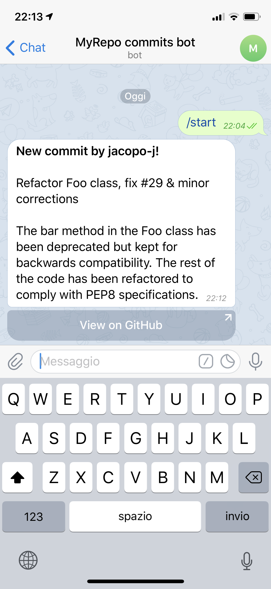

# GitHub commits Telegram bot

Quick and dirty Telegram bot for receiving notifications when new commits are pushed to a GitHub repository.

* Useful for groups of developers collaborating on a project
* Single PHP file that can be uploaded on any cheap/free web hosting with PHP support
* Works with GitHub webhooks and supports HMAC verification for added security

Parts of the code (for HMAC and headers verification) were taken from [this Gist](https://gist.github.com/jplitza/88d64ce351d38c2f4198), credits go to its author.

